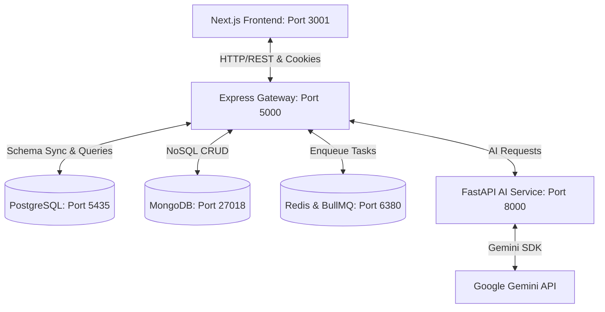

# NexusHR: Real-Time AI-Powered HR Management System

NexusHR is an enterprise-grade, full-stack Human Resource Management System (HRMS) powered by AI. It orchestrates high-end AI capabilities (via Google Gemini) with robust transactional tracking to deliver automated resume screening, intelligent chatbot assistance, sentiment analysis for performance reviews, clock-in attendance workflows, and dynamic payroll structure generation.

---

## 🏗️ System Architecture & Workflow

NexusHR is structured as a modern multi-service monorepo:



### Flow of Operations
1. **Client Interface**: Users log in to a tailwind-styled Next.js dashboard tailored to their specific roles (Admin, Manager, HR Recruiter, Employee, Candidate).
2. **Gateway**: Express routing authenticates requests using JWTs and routes transactional data to Postgres, NoSQL data to Mongo, and heavy parsing/caching to Redis.
3. **AI Processing**: FastAPI receives requests from the Express gateway. It reads resumes, processes chat messages, or analyzes review texts. If a `GEMINI_API_KEY` is provided, it invokes the live **Google Gemini model**; otherwise, it falls back to a rule-based AI simulation.

---

## 🛠️ Technology Stack

*   **Frontend**: Next.js 15 (App Router, TypeScript, Vanilla CSS + TailwindCSS styling, Lucide Icons)
*   **Backend**: Node.js, Express, TypeScript, Mongoose (MongoDB ODM), PG (PostgreSQL client)
*   **AI Microservice**: Python, FastAPI, Google Generative AI (Gemini SDK), Uvicorn
*   **Databases**:
    *   **PostgreSQL**: Relational storage for transactions (attendance logs, leave requests, payroll structures, performance ratings, alerts)
    *   **MongoDB**: Document store for rich entity records (user directory, job postings, candidate resumes/applications, chatbot history)
    *   **Redis**: Caching, session monitoring, and BullMQ queue management
*   **Containerization**: Docker & Docker Compose

---

## 🔑 Test Credentials (Pre-seeded Data)

The database is pre-seeded with real-world mock data for immediate testing. 

*   **Admin Password**: `AdminPassword@2026` (configurable in `.env`)
*   **Standard Password for All Other Seeded Users**: `Password@2026`

| Role | Email Address | Hired Title / Department | Testing Capabilities |
| :--- | :--- | :--- | :--- |
| **Admin** | `admin@fwcit.com` | System Administrator | Full dashboard view, system logs, alert monitoring, system config |
| **Manager** | `rajiv.singh@fwcit.com` | Engineering Manager | Performance reviews, leave approvals, department oversight |
| **Manager** | `aarav.sen@fwcit.com` | HR Manager | Employee directory management, department structure, global approvals |
| **HR Recruiter**| `shalini.dey@fwcit.com` | Senior Talent Acquisition | View jobs, review resumes, trigger AI resume screens, extend offers |
| **HR Recruiter**| `preeti.sen@fwcit.com` | HR Recruiter | Review candidates, change application status, view recruitment stats |
| **Employee** | `priya.sharma@fwcit.com` | Software Engineer (ENG) | Clock in/out, check attendance history, apply for leave, submit self-review |
| **Employee** | `rajesh.kumar@fwcit.com` | Backend Developer (ENG) | Request leave, track monthly pay slips, view pending system alerts |
| **Employee** | `arjun.mehta@fwcit.com` | Full Stack Engineer (ENG) | Talk to HR AI bot, clock-in, check active goals & reviews |
| **Employee** | `amit.patel@fwcit.com` | Financial Analyst (FIN) | View leave balance, check payroll summary, access self-service |

---

## ⚡ Quick Start: Running with Docker Compose (Recommended)

Running with Docker Compose sets up the entire application—frontend, backend, databases, Redis cache, and the AI microservice—with zero manual installation dependencies. It also **automatically runs database migrations and seeds the test data** on first run.

### 1. Prerequisites
Ensure you have **Docker** and **Docker Compose** installed on your host system.

### 2. Configure Environment Variables
Copy the root `.env` template and input your API keys:
```bash
cp .env.example .env
```
Open the `.env` file and insert your **Google Gemini API Key** (optional, but highly recommended for full AI features):
```env
GEMINI_API_KEY=your_actual_gemini_api_key_here
```

### 3. Spin up Services
Run the following command at the root of the workspace:
```bash
docker compose up -d --build
```

### 4. Access the Application
Once the containers are running and healthy:
*   **Frontend Dashboard**: [http://localhost:3001](http://localhost:3001)
*   **Backend API Gateway**: [http://localhost:5000](http://localhost:5000)
*   **AI Microservice**: [http://localhost:8000](http://localhost:8000)

---

## 🛠️ Manual Local Setup (Developer Mode)

If you prefer to run the services individually for active development:

### 1. Start External Databases & Cache
You need active MongoDB, PostgreSQL, and Redis instances. You can run them using Docker:
```bash
docker run -d --name hrms-mongo -p 27018:27017 mongo:6.0
docker run -d --name hrms-postgres -p 5435:5432 -e POSTGRES_DB=fwc_hrms -e POSTGRES_USER=postgres -e POSTGRES_PASSWORD=postgres postgres:15-alpine
docker run -d --name hrms-redis -p 6380:6379 redis:7.0-alpine
```

### 2. Set Up the Backend
1. Navigate to the `/backend` directory.
2. Copy `.env.example` to `.env` and verify the database connection details:
   ```env
   PORT=5000
   MONGODB_URI=mongodb://localhost:27018/fwc_hrms
   PG_HOST=localhost
   PG_PORT=5435
   PG_USER=postgres
   PG_PASSWORD=postgres
   PG_DATABASE=fwc_hrms
   REDIS_HOST=localhost
   REDIS_PORT=6380
   FRONTEND_URL=http://localhost:3001
   AI_SERVICE_URL=http://127.0.0.1:8000
   ```
3. Install dependencies and run the seed script to prepare mock data:
   ```bash
   npm install
   npm run db:init
   npm run seed
   ```
4. Start the backend developer gateway:
   ```bash
   npm run dev
   ```

### 3. Set Up the AI Service (Python FastAPI)
1. Navigate to the `/ai-service` directory.
2. Create a virtual environment and install packages:
   ```bash
   python -m venv venv
   source venv/bin/activate  # On Windows: venv\Scripts\activate
   pip install -r requirements.txt
   ```
3. Create a `.env` file in the `/ai-service` folder:
   ```env
   GEMINI_API_KEY=your_actual_gemini_api_key_here
   ```
4. Start the service:
   ```bash
   python main.py
   ```

### 4. Set Up the Frontend (Next.js)
1. Navigate to the `/frontend` directory.
2. Install dependencies:
   ```bash
   npm install
   ```
3. Start the Next.js dev server:
   ```bash
   npm run dev
   ```
4. Open [http://localhost:3001](http://localhost:3001) in your browser.

---

## 🎯 Guided Workflows to Test

### 🌟 Workflow 1: Registration and Verification (HR/Employee)
1. Go to the login page and click **Create Account**.
2. Select an internal role (e.g., *Employee* or *Manager*). The email address **must** end in `@fwcit.com`.
3. Submit the registration form. A verification email will be simulated.
4. **Check the backend terminal console logs**: You will see a block printing the mock email subject and a **Verification Link**.
5. Copy and open that link in your browser. You will see a success screen redirecting you back to [http://localhost:3001/login](http://localhost:3001/login) to login.

### 💼 Workflow 2: Candidate Application & AI Resume Screening
1. On the landing page, click **Careers Openings** or go to `http://localhost:3001/apply/mock-job-id`.
2. Sign up or register a **Candidate** account (candidates can use *any* email domain and are automatically email-verified).
3. Fill in the mock application details, attach a sample resume URL (any PDF link or dummy text works), and submit.
4. The system runs an **immediate skill-based AI screening scan**.
5. Log in as a Recruiter (`shalini.dey@fwcit.com`) and navigate to the **Recruitment Pipeline** to view the candidate’s AI score breakdown, matched/missing skills list, identified red flags, and summarized assessment.

### 💬 Workflow 3: Chatting with the AI HR Assistant
1. Log in as any Employee (e.g., `priya.sharma@fwcit.com`).
2. Open the **AI Chatbot** from the dashboard.
3. Ask questions such as:
   - *"What is my current leave balance?"*
   - *"How is my monthly payroll calculated?"*
   - *"Who is my reporting manager?"*
4. The AI service will read the employee context database and reply with accurate, personalized information.

### 📝 Workflow 4: Performance Review Sentiment Analysis
1. Log in as a Manager (`rajiv.singh@fwcit.com`).
2. Go to **Performance Reviews** and choose an employee (e.g., `Priya Sharma`).
3. Add review comments:
   - *Example Positive*: "Priya has delivered outstanding features, refactored next.js structure, and guided juniors."
   - *Example Negative*: "Priya has missed multiple deadlines, fails to coordinate with team members, and shows low code quality."
4. Click **Analyze Sentiment**. The AI service processes the comment and returns:
   - Sentiment label (Positive, Neutral, Negative)
   - Suggested score adjustments (Goals, Skills, Behavior scores out of 5)
   - Professional summary card.

### ⏰ Workflow 5: Real-time Attendance & Rate Limiting
1. Log in as an Employee.
2. Click **Clock In** on the dashboard. The system records your clock-in timestamp and client IP address. If it is after 9:15 AM, it automatically marks your status as "Late".
3. **Login Protection Lockout**: Try typing a wrong password 5 times in a row for any account. The system triggers a lockout defense. You will see a live countdown showing exactly how many seconds/minutes you must wait before trying again.

---

## 🔍 Troubleshooting & FAQs

*   **Next.js 404 Route Caches**: If you modify dashboard layouts or add folder structures and encounter persistent 404 errors on `/admin` or `/employee` routes, restart the Next.js compilation server or clear the `.next` directory to force a fresh hot-reload.
*   **No Gemini Key Error**: If `GEMINI_API_KEY` is not present, the system defaults to a mock rule-based responder. You will see warning banners inside the AI chatbot, but the flows will remain interactive.
*   **Port 3000 Conflict**: Next.js defaults to port 3000, which is often used by tools like Grafana, local development hubs, or middleware. Our configuration maps the Next.js development server to **port 3001** on the host. Make sure you browse [http://localhost:3001](http://localhost:3001) instead of 3000.
